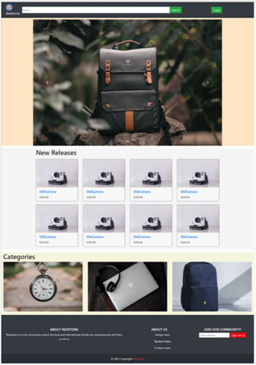
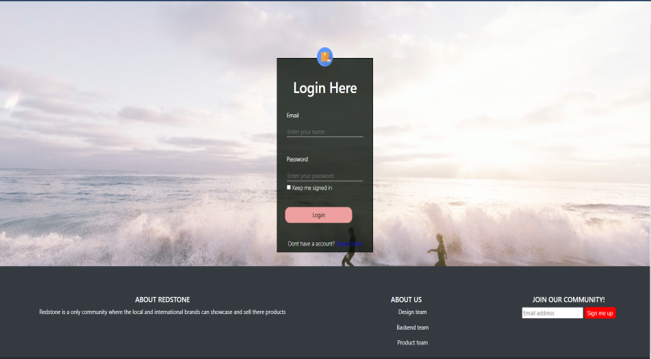
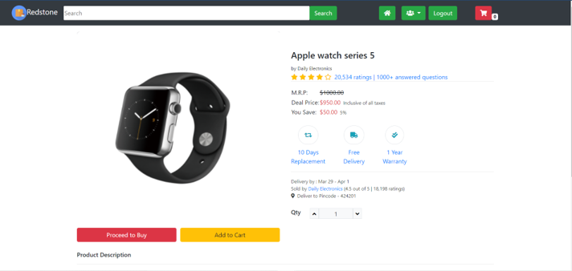
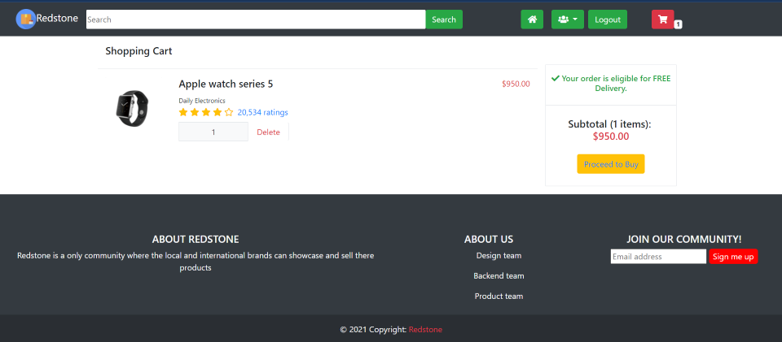
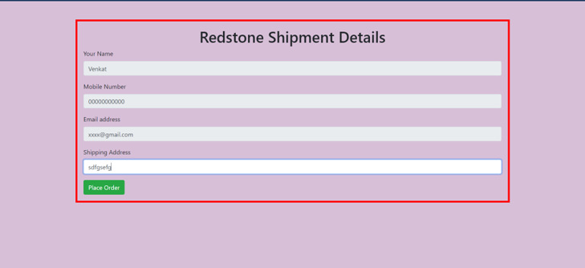
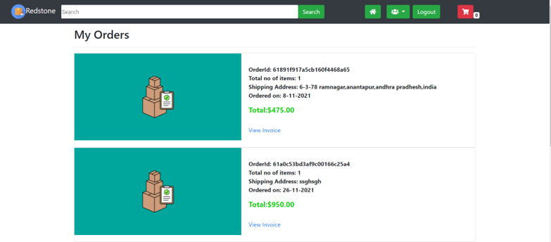

# Redstone-Source-Code
* This is a source code template of the website called Redstone(This website's actual repo has been kept in private due to some keys used in it)
* In this repo you can find the sourceCode of the website with the keys replaced with a required keys tag.

# Screenshots

